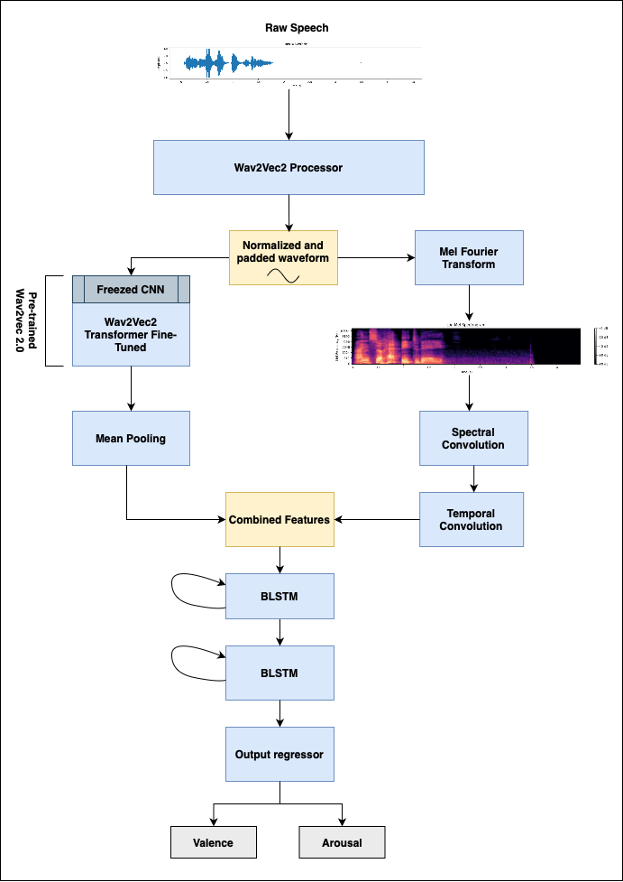
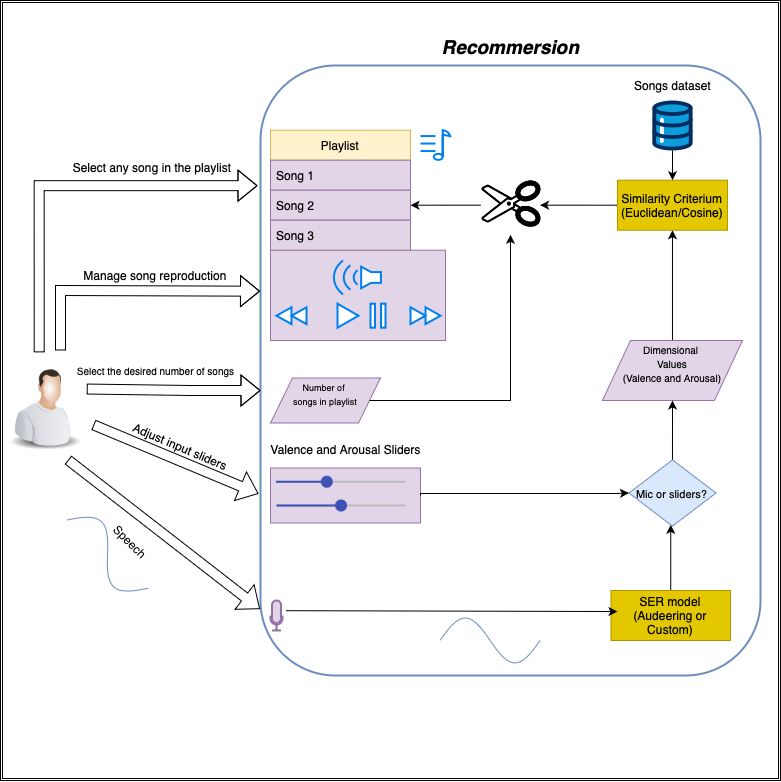
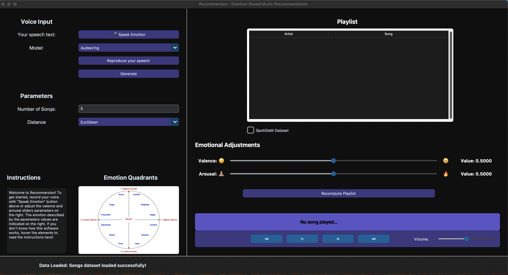

# Recommersion
**Recommersion** is a Context-Aware Recommender System (CARS) designed to suggest songs from [DEAM](https://cvml.unige.ch/databases/DEAM/), [PMEmo](https://dl.acm.org/doi/10.1145/3206025.3206037) and SpotiGeM datasets. These recommendations are based on emotional dimensional values—valence and arousal—captured through speech or manually adjusted via sliders. The system implements Speech Emotion Recognition (SER) models, including the [Model for Dimensional Speech Emotion Recognition based on Wav2vec 2.0 by Audeering](https://zenodo.org/records/6221127) and a [custom built model](./vocal_assistant/emotion/predict_emotion.py).

## Custom SER model
The custom SER model integrates two parallel processing approaches trained on a combination of [IEMOCAP](https://sail.usc.edu/iemocap/iemocap_info.htm) (widely-used dataset for multimodal emotion recognition), [MuSe-CAR](https://zenodo.org/records/4134758)  (dataset designed for emotion recognition in car driving scenarios, offering diverse emotional expressions and capturing different context circumstances) and [MSP-Podcast](https://ecs.utdallas.edu/research/researchlabs/msp-lab/MSP-Podcast.html) (corpus that has 151,654 speaking turns, which makes this dataset the largest naturalistic speech emotional one in the community. Due to its sensible dimensionality, a sample of 30% has been utilized):
   1. A Convolutional Neural Network (CNN) applied to Mel spectrograms.
   2. Fine-tuning a pre-trained Wav2vec2.0 transformer layers while freezing lower-level layers.

The combined features from these parallel approaches are processed using a **Bidirectional Long Short-Term Memory (BLSTM)** architecture for capturing temporal dependencies. A final regression layer predicts emotional dimensions (valence and arousal), enabling song recommendations through either Euclidean or Cosine similarity.




## Architecture


## Overview
**Recommersion** is a vocal assistant capable of contextualizing a specific situation based on user-provided inputs influenced by their emotional state. Its features are seamlessly integrated into a **GUI** (shown below), where users can access instructions by hovering over the interactive widgets. The system processes the user's input through a sophisticated Recommender System, which uses a Speech Emotion Recognition (SER) model and a given similarity (Euclidean or Cosine) to suggest an optimal number of tracks tailored to the given context. Once the recommendation is generated and a musical fragment begins playing, users gain access to a proper interface for valence and arousal and song's reproduction real-time adjustments.

For example, an user might say: "This song feels too happy" and control the valence parameter to increase the sadness level. They can also select any track from the generated playlist. After making their desired changes, a "Recompute Playlist" button allows users to submit updated emotional parameters, prompting the system to recalculate and refine the recommendations accordingly.

For more information, check the detailled [report](APR_and_Sound_in_Interaction_Project-Report.pdf)

## GUI


## Setup

1. Clone this repository.
2. Create a virtual python `3.10` environment.
3. Set the python packet manager to version `23.3.1`, using:
   ```bash
   $ pip upgrade --install pip==23.3.1
   ```
4. Install the imported libraries using:
   ```bash
   $ pip install -r requirements.txt
   ```
5. Run 
   ```bash 
   $ python recommersion.py
   ```

## Datasets

The datasets should be downloaded upon academic requested from:
- Training:
   - [MuSe-CAR](https://zenodo.org/records/4134758) 
   - [IEMOCAP](https://sail.usc.edu/iemocap/iemocap_release.htm)
   - [MSP-Podcast](https://ecs.utdallas.edu/research/researchlabs/msp-lab/MSP-Podcast.html)
- Songs:
   - [DEAM](https://cvml.unige.ch/databases/DEAM/)
   - [PMEmo](https://dl.acm.org/doi/10.1145/3206025.3206037)


## License

This project is licensed under the MIT License - see the [LICENSE](LICENSE) file for details.